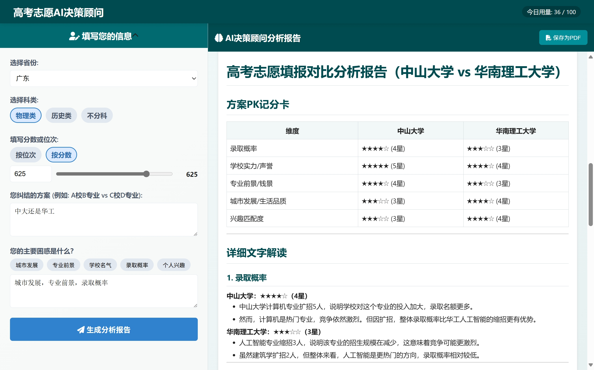
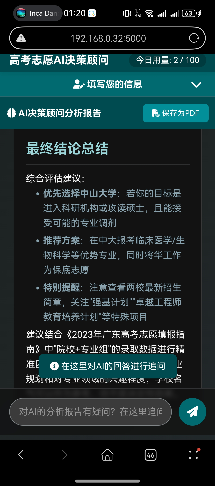
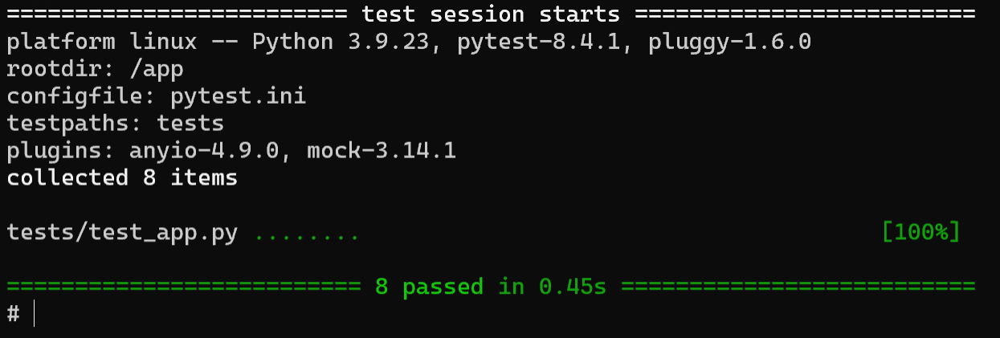

# 高考志愿AI决策顾问 V1.1 🚀

本项目是一个H5单页应用，旨在为面临高考志愿填报最后抉择的考生及家长，提供一份由AI驱动的、结合了历年分数线的深度分析报告。

V1.1版本在原基础上，新增了**邀请码认证**、**多轮对话**、**动态数据加载**、**IP速率限制**等核心功能，并优化了部署方式，使其能够**完全在GitHub Actions的免费环境中运行**，实现了状态的持久化。

---





## ✨ V1.1 功能特性

- **智能分析报告**:
  - **个性化输入**: 用户可以输入省份、科类、分数/位次，以及最纠结的几个志愿方案和主要困惑。
  - **数据驱动**: 可选加载本地的历年分数线 (`_data/scorelines/`) 数据，为AI提供更精准的决策依据。
  - **深度思考过程**: 在生成报告前，AI会先输出一段被折叠的“思考过程”，展示其分析逻辑。
  - **多维度PK记分卡**: 报告的核心是一个Markdown表格，从录取概率、学校实力、专业前景等多个维度对用户的方案进行打分和对比。
  - **对话式解读**: 报告采用亲切的对话式口吻，对记分卡的每一项进行详细解读。

- **流畅的用户体验**:
  - **流式响应 (SSE)**: 后端通过Server-Sent Events技术，将AI生成的内容以“打字机”效果逐字显示在前端。
  - **加载动画**: 在AI思考期间，“生成报告”按钮会呈现动态的彩色渐变加载动画。
  - **不对称对话气泡**: 用户的输入会以带动画的蓝色气泡形式从右侧滑入，而AI的回复则保持通栏显示，界面清晰、生动。
  - **保存为PDF**: 用户可以将生成的完整分析报告一键保存为PDF文件。

- **安全与控制**:
  - **邀请码认证**: 用户访问时，会弹出模态窗口要求输入邀请码。邀请码列表在 `_data/users.json` 中配置。
  - **IP速率限制**: 对每个IP地址进行访问频率限制（默认为10次/分钟）。
  - **每日用量限制**: 通过 `_data/usage.json` 文件进行持久化计数，会在北京时间零点自动清零。

- **多轮对话**:
  - **会话保持**: 用户在同一次会话中的多次提问会被记录和关联。
  - **上下文理解**: AI在回答新的问题时，会自动参考最近几轮的对话历史（默认为3轮）。
  - **状态持久化**: 每个会话的历史记录都会被保存在 `sessions/` 目录下，并通过GitHub Actions自动提交回仓库。

---

## 🛠️ 技术栈

- **后端 (Backend)**: Flask, Gunicorn, OpenAI SDK
- **前端 (Frontend)**: 原生 JavaScript (ES6+), HTML5, CSS3, Marked.js, jsPDF, html2canvas
- **状态存储**: 本地JSON文件 (`_data/`, `sessions/`)
- **开发与部署 (DevOps)**: Docker, Docker Compose, GitHub Actions, ngrok, Pytest

---

## 📂 项目结构

```
.
├── .github/workflows/
│   └── run-app-on-actions.yml  # GitHub Actions工作流文件
├── _data/
│   ├── scorelines/                # 历年分数线数据 (按省份年份存放)
│   │   └── jiangsu_2024.json      # (示例文件)
│   ├── usage.json                 # 每日用量计数器 (自动生成/更新)
│   └── users.json                 # 有效邀请码列表
├── sessions/                        # 对话历史记录 (自动生成/更新)
├── .env.example                   # 环境变量配置模板
├── app.py                         # Flask后端主程序
└── ... (其他前端和配置文件)
```

---

## 🚀 如何在 GitHub Actions 上免费运行

本项目经过特殊设计，可以“取巧”地利用GitHub Actions的免费额度来作为应用服务器。

### 前提
1.  **Fork本项目**: 将此仓库Fork到您自己的GitHub账户下。
2.  **注册ngrok**: 访问 [ngrok.com](https://ngrok.com) 注册一个免费账户，并在仪表板中找到您的 **Authtoken**。

### 配置步骤
进入您Fork后的GitHub仓库页面，点击 `Settings` -> `Secrets and variables` -> `Actions`，然后点击 `New repository secret` 添加以下 **Secrets**：

1.  **`NGROK_AUTHTOKEN`**: (必需) 粘贴您从ngrok获取的Authtoken。
2.  **`OPENAI_API_KEY`**: (必需) 您的AI服务API Key。
3.  **`OPENAI_API_BASE`**: (必需) 您的AI服务API地址。
4.  **`DAILY_LIMIT`**: (可选) 每日使用总次数上限，默认`100`。
5.  **`RATE_LIMIT_PER_MINUTE`**: (可选) 单IP每分钟请求上限，默认`10`。
6.  **`CONTEXT_TURNS`**: (可选) AI记忆的上下文对话轮数，默认`3`。
7.  **`LOAD_SCORE_DATA`**: (可选) 设为 `"true"` 来加载本地的历年分数线数据，默认`"true"`。

### 运行步骤
1.  **进入Actions页面**: 在您的仓库页面，点击 `Actions` 标签页。
2.  **选择工作流**: 在左侧边栏，点击 `Run App`。
3.  **手动触发**: 点击 `Run workflow` 按钮。
4.  **获取访问链接**: 等待约1-2分钟，待工作流运行起来后，点击进入该运行实例，在日志中找到由ngrok生成的 `https://....ngrok-free.app` 格式的URL。在浏览器中打开此链接即可访问。

**重要提示**:
- 此方法违反GitHub服务条款，仅供技术演示，随时可能失效。
- 每个任务最长运行6小时，之后服务会自动关闭。
- `_data/` 和 `sessions/` 目录下的文件会在任务结束时自动提交回仓库，请确保您本地的代码与远程同步（`git pull`）后再进行修改和推送。

---

## 🐳 如何在本地Docker环境启动 (用于开发)

### 前提
1.  **安装 Docker Desktop**
2.  **配置环境变量**: 复制 `.env.example` 为 `.env`，并填入您的 `OPENAI_API_KEY` 和 `OPENAI_API_BASE`。

### 一键启动
在项目根目录下，打开终端并运行：
```bash
docker-compose up --build
```
当看到日志显示 `Listening at: http://0.0.0.0:5000` 时，在浏览器中打开 `http://localhost:5000` 即可使用。
